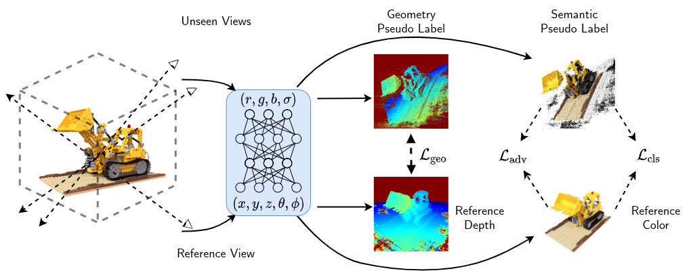

# SinNeRF: Training Neural Radiance Fields on Complex Scenes from a Single Image

[[Paper]](https://arxiv.org/abs/2204.00928) [[Website]](https://vita-group.github.io/SinNeRF/)

## Pipeline



## Code

### Environment

```
pip install -r requirements.txt
```

### Dataset Preparation

Please download the datasets from these links:

- NeRF synthetic: Download `nerf_synthetic.zip` from https://drive.google.com/drive/folders/128yBriW1IG_3NJ5Rp7APSTZsJqdJdfc1
- LLFF: Download `nerf_llff_data.zip` from https://drive.google.com/drive/folders/128yBriW1IG_3NJ5Rp7APSTZsJqdJdfc1
- DTU: Download the preprocessed DTU training data from https://drive.google.com/file/d/1eDjh-_bxKKnEuz5h-HXS7EDJn59clx6V/view

### Testing

```
python eval.py  --dataset_name llff  --root_dir /dataset/nerf_llff_data/room --N_importance 64 --img_wh 504 378 --model nerf --ckpt_path room.ckpt --timestamp test
```

Refactoring in progress.

More documentation and training scripts are coming next week!

## Acknowledgement

Codebase based on https://github.com/kwea123/nerf_pl . Thanks for sharing!

## Citation

If you find this repo is helpful, please cite:

```

@InProceedings{Xu_2022_SinNeRF,
author = {Xu, Dejia and Jiang, Yifan and Wang, Peihao and Fan, Zhiwen and Shi, Humphrey and Wang, Zhangyang},
title = {SinNeRF: Training Neural Radiance Fields on Complex Scenes from a Single Image},
journal={arXiv preprint arXiv:2204.00928},
year={2022}
}

```
